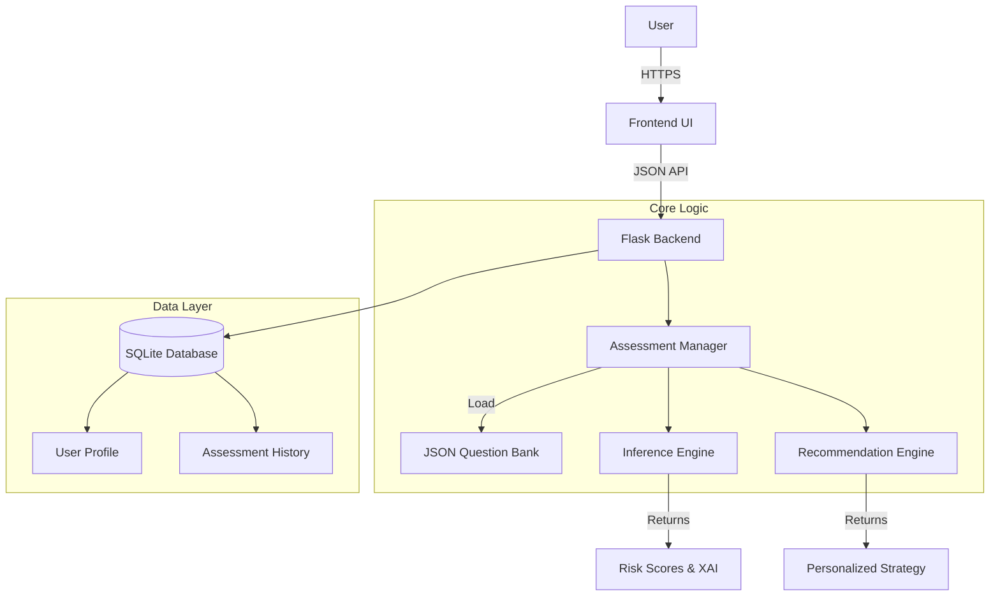
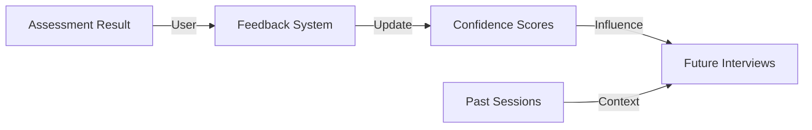

# System Architecture - Intelligent Mental Wellness Companion (IMWC) v2.0

## 1. High-Level Architecture
The IMWC follows a modular Model-View-Controller (MVC) pattern, enhanced with specialized logic engines for decision-making and explainability.

## 2. Core Components

### A. Assessment Manager (`logic/interview_engine.py`)
- **Role**: State machine for the interview process.
- **Function**: Loads questions from `data/questions.json`, determines the next question based on skip-logic, and orchestrates the final scoring.

### B. Inference Engine (`logic/inference_engine.py`)
- **Role**: The "Brain" of the system.
- **Algorithm**: Weighted Symptom Summation with Feature Contribution Analysis.
- **XAI Feature**: Calculates exactly *why* a risk score is high (e.g., "Sleep Issues contributed 15% to Anxiety score").

### C. Recommendation Engine (`logic/recommendation_engine.py`)
- **Role**: The "Therapist" logic.
- **Function**: Maps high-risk categories to     clinical coping strategies (CBT, Mindfulness, Exposure Therapy techniques).

### D. Data Layer (`data/questions.json`)
- **Role**: Configuration.
- **Benefit**: Allows changing the clinical model without touching code.

## 3. Data Flow (Interview Process)

1.  **Start**: Client requests `GET /interview`.
2.  **Next Question**: Client sends `POST /api/interview/next` with current answers.
3.  **Logic**: `AssessmentManager` checks `questions.json` for "next" field and evaluates "condition_skip".
4.  **Submit**: Client sends `POST /api/interview_submit`.
5.  **Inference**: 
    - `InferenceEngine` computes scores for Anxiety, Depression, Burnout, etc.
    - `InferenceEngine` generates XAI explanations.
6.  **Recommendation**: `RecommendationEngine` selects best tips.
7.  **Storage**: Results saved to `AssessmentResult` table.
8.  **Visualization**: User redirected to `/result` or `/dashboard`.

## 4. Adaptive Feedback Loop
The system incorporates user feedback to improve accuracy over time.

### A. How Past Data Improves Accuracy
1. **Baseline Normalization**: By analyzing previous scores, the system differentiates between chronic conditions and acute episodes.
2. **Contextual Continuity**: The system references past symptoms (e.g., "You mentioned sleep issues last time...") to provide a more human-like, continuous experience.
3. **Weight Adjustment**: Frequent negative feedback on a specific prediction triggers a review of symptom weights in the `InferenceEngine`.

### B. Interactive Flow Logic (Non-Linear)
- **State-Awareness**: The `InterviewEngine` tracks not just the current session, but user history.
- **Dynamic Follow-ups**: If a threshold is met mid-interview, the engine switches to a "Deep Dive" mode for that specific condition.
- **Empathetic Micro-interactions**: Injects supportive text between questions based on the accumulated severity.

## 5. Future Scope
- **ML Integration**: Replace weighted sums with a trained Random Forest or Neural Network (files prepared in `models/`).
- **Voice Interface**: Add Speech-to-Text to `AssessmentManager`.
- **Crisis Intervention**: Real-time webhook to emergency services if Risk > 90%.

