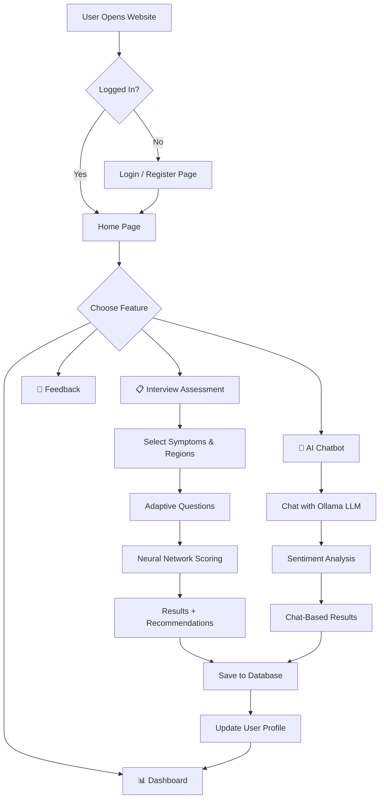

# 🧠 MindGuard — Complete Presentation Guide
### Mental Health Detection & Support Platform

---

## 📁 Project Folder Structure (What to Show First)

```
mental_health_detection/
│
├── app.py                          ← 🚀 Main Entry Point (Flask Server)
├── models.py                       ← 🗄️ Database Models (All Tables)
│
├── logic/                          ← 🧠 AI & Business Logic
│   ├── __init__.py                 ← Makes this a Python package
│   ├── interview_engine.py         ← Adaptive Interview Controller
│   ├── neural_inference_engine.py  ← Neural Network Risk Scorer
│   ├── neural_network.py           ← Custom MLP (NumPy-based)
│   ├── chatbot_engine.py           ← Ollama LLM Chatbot
│   ├── profile_engine.py           ← User Mental Health Profile Tracker
│   ├── recommendation_engine.py    ← Coping Strategy Generator
│   ├── scoring_config.py           ← Clinical Thresholds & Config
│   └── inference_engine_legacy.py  ← Legacy Rule-Based Scorer (backup)
│
├── data/                           ← 📊 Data Files
│   ├── questions.json              ← Question Bank (with weights)
│   └── neural_weights.json         ← Trained Neural Network Weights
│
├── scripts/                        ← 🔧 Utility Scripts
│   └── train_neural_engine.py      ← Neural Network Training Script
│
├── templates/                      ← 🎨 HTML Pages (Jinja2 Templates)
│   ├── base.html                   ← Base layout (navbar + footer)
│   ├── index.html                  ← Landing/Home Page
│   ├── login.html                  ← Original Login Page (legacy)
│   ├── modern_login.html           ← Modern Login/Register (active)
│   ├── interview.html              ← Assessment Interview UI
│   ├── result.html                 ← Results Page (Charts + Summary)
│   ├── chatbot.html                ← AI Chatbot Page
│   ├── dashboard.html              ← User Dashboard (Trends)
│   ├── feedback.html               ← Feedback Form (Active Learning)
│   ├── helpline.html               ← Crisis Helpline Page
│   └── admin_users.html            ← Admin Panel
│
├── static/                         ← 🖼️ Static Assets
│   ├── style.css                   ← Global Styles (colors, animations)
│   ├── interview.js                ← Interview Flow (Frontend JS)
│   ├── script.js                   ← General Scripts (chat + legacy)
│   ├── css/
│   │   └── symptomate.css          ← Symptomate-Style Clinical CSS
│   └── img/                        ← Images & Illustrations
│       ├── calm_illustration.png   ← Calm landing page illustration
│       ├── chatbot.png             ← Chatbot page illustration
│       ├── man_seating.png         ← Supportive illustration
│       ├── question.png            ← Doctor/question illustration
│       ├── result.png              ← Results page illustration
│       └── result2.png             ← Secondary results illustration
│
├── tests/                          ← 🧪 Automated Tests
│   └── test_app.py                 ← Flask route unit tests
│
├── instance/
│   └── site.db                     ← 💾 SQLite Database File
│
├── .env                            ← 🔑 Environment Variables
├── migrate_db.py                   ← 🔄 Database Migration Script
├── reset_db.py                     ← 🔄 Database Reset Script
├── verify_new_db.py                ← ✅ Database Verification Script
├── verify_refactor.py              ← ✅ Chatbot Engine Verification
├── verify_registration.py          ← ✅ Registration Flow Verification
├── test_all_scenarios.py           ← 🧪 Comprehensive Scenario Tests
├── test_improved_inference.py      ← 🧪 Neural Inference Engine Tests
├── AI_LOGIC.md                     ← 📖 AI Logic Documentation
├── ETHICS_PRIVACY.md               ← 📖 Ethics & Privacy Statement
├── SYSTEM_ARCHITECTURE.md          ← 📖 Architecture Documentation
├── IMPROVEMENTS_SUMMARY.md         ← 📖 Feature Improvements Log
└── README.md                       ← 📖 Project Overview
```

---

## 🔄 Complete Application Workflow



---

## 📂 File-by-File Explanation (Presentation Order)

---

### 1️⃣ app.py — The Main Entry Point

> *"This is the heart of our application. It's a Flask web server that handles
> all the routes (URLs) and connects the frontend to the backend logic."*

| Section                | Lines   | What It Does                                                     |
|------------------------|---------|------------------------------------------------------------------|
| Imports & Setup        | 1–23    | Imports Flask, DB, login manager; initializes all 3 engines      |
| Authentication /login  | 34–80   | Handles Login + Registration; passwords hashed with scrypt       |
| Guest Login            | 82–90   | Lets users try the system without registering                    |
| Feedback /feedback     | 100–171 | Collects feedback + Active Learning (dampens inaccurate weights) |
| Interview /interview   | 184–199 | Loads assessment page with profile context                       |
| Interview Submit       | 207–277 | Receives answers → InterviewEngine → saves results → profile     |
| Chatbot Routes         | 281–294 | /chatbot loads UI, /api/chat sends to Ollama LLM                 |
| Dashboard              | 296–360 | Fetches past assessments, formats data for Chart.js              |
| Result Page            | 411–446 | Processes raw scores into Mood/Energy/Interest insight cards      |
| App Start              | 449–452 | Creates all DB tables and starts Flask server                    |

---

### 2️⃣ models.py — Database Models

> *"This file defines all the tables in our database using SQLAlchemy ORM."*

| Model                | Purpose                          | Key Fields                                        |
|----------------------|----------------------------------|---------------------------------------------------|
| User                 | User accounts                    | email, password (hashed), name, age, gender       |
| Feedback             | User feedback on assessments     | accuracy_rating, emotional_relevance, confidence  |
| UserMentalProfile    | Long-term mental health tracking | dominant_condition, risk_level, severity_trend     |
| SymptomResponse      | Individual symptom answers       | symptom_name, severity_level, response_value      |
| UserLearningProfile  | Active learning adjustments      | condition, weight_adjustment (multiplier)         |
| ConfidenceScore      | System's self-confidence         | condition, score (0.0–1.0)                        |
| AssessmentResult     | Full assessment result (JSON)    | result_type (interview/chatbot), data (JSON)      |
| LoginHistory         | Login tracking                   | login_time, ip_address                            |
| ChatMessage          | Chatbot conversation storage     | session_id, role, content, sentiment, flagged     |

---

### 3️⃣ logic/interview_engine.py — The Adaptive Interview

> *"This is the brain of our interview system. It decides which question to ask
> next based on the user's previous answers and history."*

**How It Works:**
```
User Starts → Has Profile? → YES → Personalized opening question
                            → NO  → Load first question from questions.json
     ↓
Answer Question → Neural Network scores all answers so far
     ↓
Is a condition spiking >40? → YES → Deep Dive (ask more about that condition)
                             → NO  → Follow normal question flow
     ↓
Continue until all regions covered → Calculate Final Results + Recommendations
```

| Method                           | Lines    | What It Does                                          |
|----------------------------------|----------|-------------------------------------------------------|
| get_first_question()             | 31–78    | Checks profile/history to personalize opening         |
| get_next_question()              | 79–183   | Core adaptive logic — real-time neural branching      |
| calculate_results()              | 195–237  | Neural scoring → Recommendations → Summary            |
| _generate_personalized_summary() | 262–375  | Creates calm, non-diagnostic narrative text            |

---

### 4️⃣ logic/neural_network.py — Custom Neural Network (NumPy)

> *"Our custom-built neural network using only NumPy — no PyTorch or TensorFlow."*

**Architecture:**
```
Input Layer (28)  →  Hidden Layer (64, ReLU)  →  Output Layer (7, Sigmoid)
  questions            neurons                    conditions (0 to 1)
```

| Concept              | Explanation                                                  |
|----------------------|--------------------------------------------------------------|
| He Initialization    | Weights for ReLU: sqrt(2/n) to prevent vanishing gradients   |
| Xavier Initialization| Weights for Sigmoid: sqrt(1/n) for stable training           |
| ReLU                 | max(0, x) — passes positives, blocks negatives               |
| Sigmoid              | 1/(1+e^(-x)) — squashes output between 0 and 1              |
| Forward Pass         | Input → W1+b1 → ReLU → W2+b2 → Sigmoid → output            |
| Backpropagation      | train_step() calculates gradients and updates weights        |
| Save/Load Weights    | Stored as JSON in data/neural_weights.json                   |

---

### 5️⃣ logic/neural_inference_engine.py — The Neural Scoring Engine

> *"The bridge between user answers and the neural network.
> Converts text answers into numbers the network can understand."*

**Pipeline:**
```
User Answers → Feature Vector → SimpleMLP.forward() → Formatted Results
{"start":"yes"} → [1.0, 0.0, ...]  → probabilities    → [{condition, %, severity}]
```

| Method                | Lines    | What It Does                                          |
|-----------------------|----------|-------------------------------------------------------|
| _get_feature_vector() | 34–60    | Converts: "yes"→1.0, "no"→0.0, multi-choice→index    |
| calculate_scores()    | 61–112   | Forward pass → 0-100 scale → severity + status color  |
| _get_severity()       | (legacy) | Maps scores to Minimal/Mild/Moderate/Severe           |
| _get_status_color()   | (legacy) | Green (<20), Yellow (20-45), Orange (45-70), Red (>70)|
| _get_contributors()   | 142–157  | Which questions most influenced each condition (XAI)   |

---

### 6️⃣ logic/scoring_config.py — Clinical Configuration

> *"All clinical thresholds and scoring parameters used by our engines."*

| Section              | Purpose                          | Example                                |
|----------------------|----------------------------------|----------------------------------------|
| Severity Thresholds  | Maps scores to clinical levels   | Depression: Minimal(0), Mild(5), Moderate(10), Severe(20) — PHQ-9 |
| Symptom Clusters     | Groups related questions         | Depression: "Core Mood" + "Cognitive" + "Somatic"                 |
| Comorbidity Matrix   | Accounts for condition overlaps  | Anxiety-Depression: 20% overlap                                   |

---

### 7️⃣ logic/chatbot_engine.py — AI Chatbot (Ollama/LLM)

> *"Our chatbot uses a locally-hosted LLM via Ollama. No data sent externally."*

**Flow:**
```
User message → Safety Check (suicide keywords?) → Ollama LLM → Response
                     ↓ (if flagged)
              "If you're in danger, please seek help..."
```

| Feature                 | How It Works                                               |
|-------------------------|------------------------------------------------------------|
| Model Auto-Detection    | Checks installed models: llama3 → phi3 → mistral → gemma  |
| Safety Moderation       | Keyword-based flagging for self-harm content               |
| Sentiment Analysis      | TextBlob polarity on each message                          |
| Multi-Model Prompts     | Auto-formats prompts for different LLM architectures       |
| Conversation Storage    | All messages saved to DB with sentiment scores             |
| Final Prediction        | Averages sentiment across all messages for overall status  |

---

### 8️⃣ logic/profile_engine.py — User Profile Tracker

> *"Maintains a long-term mental health profile, updated after every assessment."*

| Data Tracked         | Example                                                     |
|----------------------|-------------------------------------------------------------|
| dominant_condition   | "Anxiety"                                                   |
| risk_level           | "Moderate"                                                  |
| symptom_frequency    | {"insomnia": 5, "fatigue": 2} — counts per symptom          |
| severity_trend       | [{date: "2024-01-15", condition: "Anxiety", score: 67},...] |

---

### 9️⃣ logic/recommendation_engine.py — Coping Strategy Generator

> *"Provides actionable, evidence-based coping strategies based on results."*

| Condition        | Strategy                        | Time    |
|------------------|---------------------------------|---------|
| Anxiety          | 4-7-8 Breathing Exercise        | 5 mins  |
| Anxiety          | 5-4-3-2-1 Grounding Technique   | 2 mins  |
| Depression       | Behavioral Activation           | 10 mins |
| Depression       | 15 min Sunlight Exposure        | 15 mins |
| Burnout          | Digital Detox before bed        | 1 hour  |
| Panic Disorder   | Ice Cube Trick                  | 1 min   |

- Only shows strategies for conditions scoring above 20%
- Max 2 per condition, 6 total (to avoid overwhelming)

---

### 🔟 data/questions.json — The Question Bank

> *"All assessment questions organized by mental health regions."*

| Region               | Key Questions                                      | Examples                            |
|----------------------|----------------------------------------------------|-------------------------------------|
| Stress & Anxiety ⚡   | start, anxiety_duration, anxiety_triggers, panic    | "Do you often feel anxious?"        |
| Mood & Emotions ❤️    | mood_q1, mood_interest, mood_suicide_check          | "Have you felt depressed?"          |
| Sleep & Energy 💤     | sleep_q1, energy_q1, sleep_hygiene                  | "How is your sleep quality?"        |
| Focus & Cognition 🧠  | cognitive_q1, cognitive_restless                    | "Trouble focusing?"                 |
| Social 👥             | social_anxiety_q1, social_situations                | "Do you avoid social situations?"   |
| Lifestyle 🌱          | burnout_q1, lifestyle_exercise, lifestyle_diet      | "Feel emotionally exhausted?"       |

Each question has:
- **type**: statement (Yes/No/Unsure) or group_single (multiple choice)
- **weight**: How much "yes" adds to each condition (e.g., {"Anxiety": 5})
- **next_logic**: Conditional branching (if "yes" → go to X, if "no" → skip to Y)

---

### 1️⃣1️⃣ static/interview.js — Frontend Interview Controller

> *"Controls the entire interview UI — step-by-step flow, animations, and API calls."*

**The 6-Step Flow:**
```
Step 1: Intro → Step 2: Patient Info → Step 3: Symptoms →
Step 4: Regions → Step 5: Adaptive Interview → Step 6: Results
```

| Function            | Lines    | What It Does                                          |
|---------------------|----------|-------------------------------------------------------|
| handleNext()        | 98–149   | Validates current step → advances to next             |
| fetchNextQuestion() | 198–232  | Calls /api/interview/next → gets adaptive question    |
| renderQuestion()    | 239–307  | Renders question cards with options + progress bar     |
| selectAnswer()      | 308–356  | Records answer → micro-feedback → auto-advance 500ms  |
| submitFinal()       | 366–399  | Sends all data to /api/interview_submit → results     |
| renderRegions()     | 400–414  | Displays 6 region cards with history preselection      |

---

### 1️⃣2️⃣ static/script.js — General Purpose Frontend Scripts

> *"Handles chatbot UI interactions and legacy interview functions."*

**Section 1 — Legacy Interview (Lines 1–88):**

| Function          | Lines  | What It Does                                            |
|-------------------|--------|---------------------------------------------------------|
| nextPhase()       | 2–5    | Shows next phase (hide current, show next)              |
| prevPhase()       | 7–10   | Goes back to previous phase                             |
| loadFollowups()   | 12–57  | Calls /api/get_followups → renders follow-up questions  |
| submitInterview() | 59–88  | Collects FormData → POST to /api/interview_submit       |

**Section 2 — Chatbot (Lines 90–176):**

| Function          | Lines   | What It Does                                           |
|-------------------|---------|--------------------------------------------------------|
| handleEnter()     | 93–97   | Enter key → triggers sendMessage()                     |
| useChip()         | 99–103  | Starter chip click → auto-fills and sends              |
| sendMessage()     | 105–135 | Sends message to /api/chat → displays bot response     |
| addMessageToChat()| 137–153 | Renders message bubble (supports Markdown via marked.js)|
| finishChat()      | 155–175 | Sends chatHistory to /api/chat_analyze → results page  |

---

### 1️⃣3️⃣ Templates — HTML Pages (Jinja2)

| Template           | Size    | Purpose                                                |
|--------------------|---------|--------------------------------------------------------|
| base.html          | 1.7 KB  | Base layout: navbar, footer, CSS/JS imports            |
| index.html         | 1.6 KB  | Landing page with links to Interview, Chatbot, Dash    |
| login.html         | 3.7 KB  | Legacy login page (simple tabs, kept as fallback)      |
| modern_login.html  | 20.5 KB | Active login: glassmorphism, animations, guest mode    |
| interview.html     | 10.5 KB | 6-step assessment UI with sidebar + dynamic questions  |
| result.html        | 19.4 KB | Radial charts, insight cards, summary, recommendations |
| chatbot.html       | 2.8 KB  | Chat window, starter chips, Analyze button             |
| dashboard.html     | 4.4 KB  | Chart.js trend graphs, assessment history, stats       |
| feedback.html      | 10.4 KB | Accuracy rating, confidence sliders, missed symptoms   |
| helpline.html      | 1.5 KB  | Crisis helpline numbers (always accessible, no login)  |
| admin_users.html   | 1.4 KB  | Admin view of registered users                         |

---

### 1️⃣4️⃣ CSS & Styling

| File                    | Purpose                                               |
|-------------------------|-------------------------------------------------------|
| static/style.css        | Global styles — colors, typography, animations        |
| static/css/symptomate.css | Symptomate-inspired clinical UI — white, soft blue  |

---

### 1️⃣5️⃣ logic/inference_engine_legacy.py — Legacy Rule-Based Scorer

> *"Our original scoring engine before the neural network. Kept as backup."*

**Legacy vs Neural Comparison:**

| Feature          | Legacy Engine                    | Neural Engine                    |
|------------------|----------------------------------|----------------------------------|
| Scoring Method   | Weighted sum + sigmoid           | Neural network forward pass      |
| Accuracy         | Good for linear patterns         | Better for complex interactions  |
| Speed            | Very fast (direct calculation)   | Slightly slower (matrix math)    |
| Active Learning  | ✅ Reads UserLearningProfile     | ❌ Uses fixed trained weights    |
| When Used        | Fallback if neural weights fail  | Primary engine for assessments   |

**Key Methods:**

| Method                      | Lines    | What It Does                                   |
|-----------------------------|----------|-------------------------------------------------|
| calculate_scores()          | 12–198   | Accumulates weighted scores → sigmoid → severity|
| _get_user_adjustments()     | 200–209  | Fetches per-user weight multipliers from DB      |
| _get_severity()             | 211–235  | Maps 0–100 to Minimal/Mild/Moderate/Severe       |
| _get_status_color()         | 237–241  | Green/Yellow/Orange/Red traffic light            |
| _calculate_max_possible()   | 243–286  | Max theoretical score per condition (cached)     |
| _normalize_score()          | 288–316  | Sigmoid: 100 / (1 + e^(-k*(x - m)))             |

**Explainability Features:**

| Feature              | What It Does                                          |
|----------------------|-------------------------------------------------------|
| Contributors (XAI)   | Top 3 questions that influenced each condition        |
| Explanation Summary  | "Elevated Anxiety, driven by worry, panic symptoms"   |
| Trend Direction      | Persistent / Improving / Worsening / Stable / Shift   |
| Confidence Score     | Base 85%, penalized for ambiguity or low signal       |

---

### 1️⃣6️⃣ scripts/train_neural_engine.py — Neural Network Training

> *"Generates synthetic training data and trains the neural network offline."*

**Training Pipeline:**
```
questions.json → 5000 Synthetic Samples → Train MLP (100 epochs) → neural_weights.json
```

**Synthetic Data Generation (4 steps):**

| Step                    | What Happens                                          |
|-------------------------|-------------------------------------------------------|
| 1. Random Answers       | 30% chance of "yes" per question (general population) |
| 2. Linear Weighting     | Applies same weights from questions.json              |
| 3. Non-Linear Effects   | Interaction effects (comorbidity amplification)       |
| 4. Sigmoid Target       | Normalizes to 0–1 range for neural output             |

**Non-Linear Interactions (Secret Sauce):**

| Interaction                     | Effect                                     |
|---------------------------------|--------------------------------------------|
| Depression + Insomnia           | Depression ×1.3, Sleep Issues ×1.2         |
| Anxiety + Panic Triggers        | Panic Disorder ×1.5                        |
| Burnout + High Anxiety          | Burnout ×1.4                               |
| Suicidal Ideation               | Depression = max(score, 40.0) — safety net |

**Training Parameters:**

| Parameter      | Value                  | Why                                   |
|----------------|------------------------|---------------------------------------|
| Samples        | 5,000                  | Enough diversity without overfitting  |
| Epochs         | 100                    | Sufficient for convergence            |
| Batch Size     | 32                     | Standard mini-batch                   |
| Learning Rate  | 0.05                   | Balanced speed/stability              |
| Shuffle        | Every epoch            | Prevents memorizing order             |
| Output         | neural_weights.json    | W1, b1, W2, b2 as JSON               |

---

### 1️⃣7️⃣ logic/__init__.py — Python Package Initializer

> *"Empty file (0 bytes) but essential — tells Python that logic/ is a package."*

Without this file, imports like `from logic.interview_engine import InterviewEngine` would fail.

---

### 1️⃣8️⃣ Static Images (static/img/) — UI Illustrations

| Image                  | Size    | Used In             | Purpose                          |
|------------------------|---------|---------------------|----------------------------------|
| calm_illustration.png  | 613 KB  | Landing / Interview | Soothing abstract illustration   |
| chatbot.png            | 1.9 MB  | Chatbot page        | Friendly AI character            |
| man_seating.png        | 1.2 MB  | Various pages       | Supportive cartoon character     |
| question.png           | 111 KB  | Interview questions | Doctor/helper guide character    |
| result.png             | 1.3 MB  | Results page        | Assessment results header art    |
| result2.png            | 125 KB  | Results page        | Recommendation section art       |

Design: Soft, rounded, cartoon-style art (Headspace/Calm inspired). No clinical imagery.

---

### 1️⃣9️⃣ .env — Environment Configuration

| Variable                  | Purpose                              | Note                         |
|---------------------------|--------------------------------------|------------------------------|
| FLASK_ENV=development     | Debug mode, auto-reload              | Set to production in deploy  |
| SECRET_KEY=dev_secret_key | Session encryption + CSRF protection | Use strong random in prod    |
| ~~OPENAI_API_KEY~~        | Removed — using local Ollama         | No cloud API keys            |
| ~~HUGGINGFACE_TOKEN~~     | Removed — custom NumPy network       | Full local control           |

---

### 2️⃣0️⃣ Database Utility Scripts

| Script                 | Purpose                                                    |
|------------------------|------------------------------------------------------------|
| migrate_db.py          | Adds new columns/tables without losing data                |
| reset_db.py            | Drops ALL tables, recreates from models.py + test user     |
| verify_new_db.py       | Checks all expected tables exist after migration           |
| verify_refactor.py     | Tests ChatbotEngine: model loading, scoring, responses     |
| verify_registration.py | End-to-end registration test (POST → check DB)             |

---

### 2️⃣1️⃣ Test Scripts — Quality Assurance

**tests/test_app.py — Unit Tests:**

| Test Case              | What It Tests                                         |
|------------------------|-------------------------------------------------------|
| test_home_page()       | GET / returns 200 + "Mental Health Assessment"        |
| test_interview_page()  | GET /interview returns 200                            |
| test_interview_submit()| POST /api/interview_submit → JSON with redirect       |
| test_chatbot_analyze() | POST /api/chat_analyze → JSON with redirect           |

**test_all_scenarios.py — 8 Clinical Scenarios:**

| Scenario                    | Input                               | Expected                  |
|-----------------------------|--------------------------------------|--------------------------|
| 1. Healthy Individual       | All "no" + regular exercise          | Green, all Minimal       |
| 2. Mild Anxiety             | Recent stress, few days              | Yellow, Anxiety ~20-30%  |
| 3. Moderate Anxiety + Panic | Weeks of anxiety + panic triggers    | Orange, Anxiety elevated |
| 4. Moderate Depression      | Depressed + insomnia + fatigue       | Depression ~40-60%       |
| 5. Severe Depression 🔴     | Suicidal ideation + insomnia + subs  | Red, Depression 90%+     |
| 6. Work Burnout             | Exhaustion + cynicism                | Burnout dominant         |
| 7. Social Anxiety           | Avoids social + physical symptoms    | Social Anxiety dominant  |
| 8. Comorbid Anxiety+Dep     | Both anxiety AND depression symptoms | Both elevated            |

**test_improved_inference.py — Neural Engine Tests:**

| Test Case           | Input                                  | Expected                 |
|---------------------|----------------------------------------|--------------------------|
| Moderate Anxiety    | Anxious=yes, Duration=weeks, Panic=yes | Anxiety top, Yellow      |
| Emotionally Stable  | All "no" answers                       | All <10%, Green          |
| Severe Depression   | Depressed + suicidal + insomnia        | Depression 80%+, Red     |

---

### 2️⃣2️⃣ Documentation Files

| File                   | Contents                                                   |
|------------------------|------------------------------------------------------------|
| AI_LOGIC.md            | Hybrid detection (rules + sentiment + neural), history     |
| ETHICS_PRIVACY.md      | Data anon, consent, fairness, secure storage, ethics       |
| SYSTEM_ARCHITECTURE.md | Full tech architecture: Flask, SQLAlchemy, Ollama          |
| IMPROVEMENTS_SUMMARY.md| Algorithm improvements: sigmoid, PHQ-9/GAD-7, config      |
| README.md              | Project overview and setup instructions                    |

---

### 2️⃣3️⃣ instance/site.db — SQLite Database

| Property    | Detail                                                      |
|-------------|-------------------------------------------------------------|
| Type        | SQLite 3 — serverless, zero-config, self-contained          |
| Tables      | 9 tables from models.py                                     |
| Created By  | db.create_all() in app.py at startup                        |
| Reset       | python reset_db.py for clean slate                          |
| Migrate     | python migrate_db.py to add columns without data loss       |
| Portability | Copy site.db to another machine — entire DB in one file     |

---

## 🔐 Security Features (For Ethics/Security Slide)

| Feature              | Implementation                                             |
|----------------------|------------------------------------------------------------|
| Password Hashing     | scrypt via Werkzeug — never stored as plain text           |
| Login Required       | @login_required decorator on sensitive routes              |
| Guest Mode           | Users can try without registering — no data saved          |
| Content Moderation   | Chatbot checks for self-harm keywords before processing    |
| Local AI             | Ollama runs locally — no user data sent to cloud           |
| Session Management   | Flask sessions with secret key for CSRF protection         |

---

## 🧪 AI/ML Features Summary (For AI Slide)

| Feature                  | Technology                                              |
|--------------------------|---------------------------------------------------------|
| Neural Network           | Custom MLP (NumPy) — 28 inputs → 64 hidden → 7 outputs |
| Adaptive Questioning     | Real-time neural scoring to dynamically branch          |
| Sentiment Analysis       | TextBlob polarity on chatbot messages                   |
| Active Learning          | Feedback adjusts condition weights (dampen/amplify)     |
| Profile Personalization  | Past assessments influence future question ordering     |
| Explainability (XAI)     | Each prediction shows contributing questions            |
| Clinical Thresholds      | PHQ-9 and GAD-7 aligned severity levels                 |
| Comorbidity Handling     | Symptom overlap matrix for related conditions           |
| Trend Analysis           | Tracks Improving/Stable/Worsening/Shift over time       |
| LLM Chatbot              | Ollama (llama3/phi3/gemma) with multi-model formatting  |

---

## 🗣️ Suggested Presentation Flow (Slide Order)

 1. **Introduction**        — What is MindGuard? Problem statement
 2. **Architecture**        — Show the folder structure diagram (all files)
 3. **Live Demo**           — Register → Interview → Results → Chatbot
 4. **app.py**              — Routes + frontend-backend connection
 5. **models.py**           — 9 database tables + SQLite
 6. **interview_engine**    — Adaptive logic with flowchart
 7. **neural_network**      — MLP architecture + inference engine pipeline
 8. **legacy_engine**       — Compare rule-based vs neural approach
 9. **train_neural_engine** — Synthetic data + non-linear interactions
10. **chatbot_engine**      — Local LLM integration (Ollama)
11. **profile_engine**      — Personalization over time
12. **recommendation**      — Sample coping strategies
13. **questions.json**      — Question structure + weights + branching
14. **interview.js + script.js** — Frontend flow + chatbot UI
15. **Templates**           — Key HTML pages walkthrough
16. **CSS & Styling**       — Design system + Calm/Headspace philosophy
17. **Database & Utilities**— site.db, migrate, reset, verify scripts
18. **Testing & QA**        — 8 clinical scenarios + safety-critical tests
19. **Security & Ethics**   — Hashing, local AI, privacy, consent
20. **Documentation**       — AI_LOGIC.md, ETHICS_PRIVACY.md references
21. **Future Scope**        — What could be improved

---

> **TIP — Live Demo:** Show adaptive behavior: answer "yes" to anxiety →
> watch it ask more anxiety follow-ups. Then answer "no" → it skips to mood.
> This demonstrates the adaptive AI clearly.

> **TIP — Q&A Prep:**
> - Why NumPy not PyTorch? → "Lightweight, no heavy deps, runs anywhere"
> - Why synthetic data? → "No real patient data, but derived from clinical rules"
> - Why Ollama not OpenAI? → "100% local, no data leaves the machine"
> - Why two engines? → "Legacy as fallback, neural for complex interactions"
